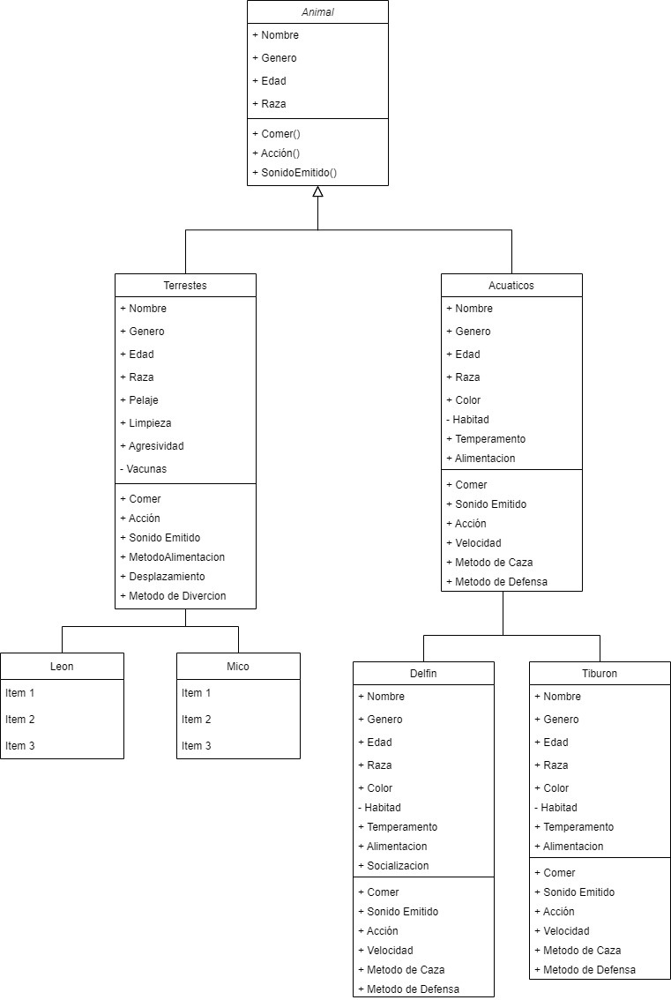

# ProgramacionAplicada

Hola Profe que tal?

Este modelo se realizo creando la Calse Animales como Clase Principal en la cual Contiene unos atributos principales que son:
+ Nombre 
+ Genero
+ Edad
+ Raza

Y unos Metodos:

+ Comer()
+ Accion()
+ SonidoEmitido()

De hay se generan las Siguientes dos Clases:

- Terrestres 
- Acuaticos

Estas dos clases obtienen Polimorfismo con la clase Animales.

De la clase Terrestres Se generan dos clases mas las cuales son:
- Leon 
- Mico

De igual obtiene polimorfismo de la clase terrestre

Ahora de la clase Acuaticos se generan dos clases mas, las cuales son:
- Delfin
- Tiburon

Adicional Agregamos el Modelo para que se pueda visualizar bien el Modelo
